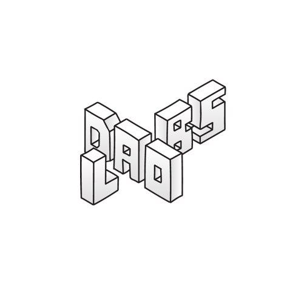

<p align="center">
    
</p>

## Animation-Url

Collection of routes which contains paths which render various content. The purpose is to consolidate the animation_url property for nfts which allow for HTML, JS, CSS - to provide a rich experience for content generated from the DAOLABS tooling regardless of the NFT content type.

Utilities include identifying IPFS CID and fetching content from IPFS. Encoding and decoding v1, v2 CID, parsing NFT JSON.

### Default route

An overview of the routes and default example content to render such that accessing the route on content load immediately conveys whether the route and rendering properly operates. Routes provide rendering types of HTML by them and by content.

#### /images

The config is defined by the below through either passing base64 encoded json string, or passing a url pointing to the json:

```ts
type Placement = {
	top?: string;
	right?: string;
	bottom?: string;
	left?: string;
};

type Size = {
	width?: string;
	height?: string;
	'font-size'?: string;
};

type TextStyle = {
	color?: string;
	placement?: Placement;
	textAlign?: 'center' | 'left' | 'right';
	size?: Size;
};

type ImageStyle = {
	placement?: Placement;
	size?: Size;
	cover?: boolean;
};

type Text = {
	text: string;
	style?: TextStyle;
};

type BorderStyle = {
	color?: string;
	type?: 'solid' | 'dashed' | 'dotted';
	width?: string;
};

type CardFace = {
	background?: string;
	innerBorder?: BorderStyle;
	icons?:
		| [
				{
					icon: string;
					// NOTE: Icons are svg's and are thus styleable with textStyle
					iconStyle?: TextStyle;
				}
		  ]
		| [];
	image?: string;
	imageStyle?: ImageStyle;
	logo?: string;
	logoStyle?: ImageStyle;
	title?: string;
	titleStyle?: TextStyle;
	leftVertical?: string;
	leftVerticalStyle?: TextStyle;
	rightVertical?: string;
	rightVerticalStyle?: TextStyle;
	texts?: Text[];
};

export type CardConfig = {
	common: CardFace;
	front?: CardFace;
	back?: CardFace;
};
```

- **card-vertical**.

  See example `/images/card-vertical?image=QmXHt66FELHYMgQbWVq1nZ5FxzgyNq6gbNBeNKNA7YccSW/1.png&title=MeowsDAO&background=black&spin=true`. Style further by passing a CardConfig in a `config=` searchParam
- **card-horizontal**

  See example `/images/card-horizontal?image=QmXHt66FELHYMgQbWVq1nZ5FxzgyNq6gbNBeNKNA7YccSW/1.png&title=MeowsDAO&background=black&spin=true`. Style further by passing a CardConfig in a `config=` searchParam.

- **card-round**
  See example `/images/card-round?image=QmXHt66FELHYMgQbWVq1nZ5FxzgyNq6gbNBeNKNA7YccSW/1.png&title=MeowsDAO&background=black&spin=true`. Style further by passing a CardConfig in a `config=` searchParam.

- [card-halo-effect-vertical](https://codepen.io/simeydotme/pen/PrQKgo)
- card-halo-effect-horizontal
- [mouse-wave](https://codepen.io/alphardex/pen/RwoYaMY)
- [hallucination-effect](https://codepen.io/tankbottoms/pen/YzLxqGa)
- [chunky](https://codepen.io/tankbottoms/pen/bGMrpBJ)
- floating in space

#### /music

- **basic player** See example `/music?cid=Qmbaj3ASjHMbZ9qh3Wz7yGaKWGLKjE8dcvUKErZWqTL8Ad`. Where the cid points to a json of the form, **or** is base64 of the form:

  ```json
  {
  	"cover": "a url to the cover",
  	"tracks": [
  		{
  			"file": "a url to the music file",
  			"name": "the track name",
  			"artist": "the track artist"
  		}
  	]
  }
  ```

#### /video

The config is defined by the below through either passing base64 encoded json string, or passing a url pointing to the json:

```ts
VideoPlayerType {
  /**
   * Real width of video for calculating aspect ratio for responsive design
   * @default 1920
   */
  width?: number | string;

  /**
   * Real height of video for calculating aspect ratio for responsive design
   * @default 1080
   */
  height?: number | string;

  /**
   * Absolute or relative URL of poster image
   * @default ''
   */
  poster?: string;

  /**
   * Absolute or relative URL (or array of those) of video source. Supported formats are `webm`, `mp4` and `ogg`
   * @default ''
   */
  source?: string | string[];

  /**
   * Height of bottom control bar, rescaling included components
   * @default '55px'
   */
  controlsHeight?: string;

  /**
   * Height of playbar and volume slider tracks
   * @default '6px'
   */
  trackHeight?: string;

  /**
   * Size of playbar and volume slider thumb
   * @default '15px'
   */
  thumbSize?: string;

  /**
   * Size of center icon
   * @default '60px'
   */
  centerIconSize?: string;

  /**
   * Color of player background
   * @default 'black'
   */
  playerBgColor?: string;

  /**
   * Main color of control components
   * @default '#FF3E00'
   */
  color?: string;

  /**
   * Color of focus outlines
   * @default 'white'
   */
  focusColor?: string;

  /**
   * Background color of playbar and volume slider tracks
   * @default 'white'
   */
  barsBgColor?: string;

  /**
   * Color of button icons
   * @default 'white'
   */
  iconColor?: string;

  /**
   * Color of buffered chunks
   * @default '#FF9600'
   */
  bufferedColor?: string;

  /**
   * Display overlay with buffered and played parts of video
   * @default false
   */
  chunkBars?: boolean;

  /**
   * Rounded corner radius of the player
   * @default '8px'
   */
  borderRadius?: string;

  /**
   * Play video in loop
   * @default false
   */
  loop?: boolean;

  /**
   * Skipping time in seconds
   * @default 5
   */
  skipSeconds?: number | string;

  /**
   * Show control bar when video is paused
   * @default true
   */
  controlsOnPause?: boolean;

  /**
   * Display current time beside playbar
   * @default false
   */
  timeDisplay?: boolean;
}
```

See the video player library for inspiration on how to tweak the looks: `https://svelte-video-player.netlify.app/`

- **fixed resolution** See example `/video?video=bafybeiaqyn5wolrdfcskbicvuwden75cwdn3cr7fjliaj4lsj7zziqzkii&config=eyJoZWlnaHQiOjQ1MCwid2lkdGgiOjkwMH0=`

- **full screen** See example `/video?video=bafybeihsz2r72omrnsiqxksbacby7ajw4eqguyjv42h3deixtnmf4jwhlm`

#### /p5-js

The config is defined by the below through either passing base64 encoded json string, or passing a url pointing to the json:

```ts
type Config = {
	seed?: number;
	width?: Unit;
	height?: Unit;
	fullscreen?: boolean;
	respectAspectRatio?: boolean;
};
```

- **fixed resolution** by setting `width` and `height` on the p5js config
  `/p5js?script=QmcGKReCjttTrvNkYm41jpDnNmD2gMVtjepsthpfrPB2vd&config=eyJzZWVkIjo1MCwid2lkdGgiOiI1MDBweCIsImhlaWdodCI6IjUwMHB4In0=`

  Where the config corresponds to `'{"seed":50,"width":500,"height":500}'`

- **full screen** by setting `fullscreen` on the p5js config
  `/p5js?script=QmcGKReCjttTrvNkYm41jpDnNmD2gMVtjepsthpfrPB2vd&config=eyJzZWVkIjoyMCwiZnVsbHNjcmVlbiI6dHJ1ZSwicmVzcGVjdEFzcGVjdFJhdGlvIjp0cnVlfQ==`

  Where the config corresponds to `'{"seed":20,"fullscreen":true,"respectAspectRatio":true}'`

#### /animation

##### svg

- [particles](https://github.com/tankbottoms/whiskers-particles)
- draw/fill
- [sacred-geometry](https://codepen.io/tankbottoms/pen/mdxbmZd)
- [project](https://github.com/tankbottoms/uniswap-nft-template) or [uniswap](https://github.com/cptspacecadet/uniswap-lp-nfts)

###### libraries

- [vivus](http://maxwellito.github.io/vivus/)

### Key-presses

- `Spacebar`: toggle animation, background color change/cycle, play-pause
- `Arrow-up/down`: volume up/down, brightness up/down
- `Arrow-left/right`: volume left/right, brightness left/right, speed

---

## Reference, Resources

- [halo effect](https://github.com/tankbottoms/halo-card-effect)
- [example pass](https://github.com/tankbottoms/rick)
- [media/audio/video player](https://vimejs.com/)

### Alternatives

- [alt audio player](https://github.com/fengkx/svelte-aplayer)
- [alt video player](https://github.com/meigo/svelte-video-player)

### NFTs

- [peace](https://github.com/tankbottoms/peace-generative-nft)
- [Template](https://github.com/tankbottoms/eth-seven-twenty-one-utils)

### Research

- [Islamic Star Patterns](https://www.mi.sanu.ac.rs/vismath/kaplan/index.html)

---

## Developing

```bash
npm run dev

# or start the server and open the app in a new browser tab
npm run dev -- --open
```

## Building

```bash
npm run build
```

## Add a new route

- create a folder for route in `src/routes`
- add a `+page.svelte` file
